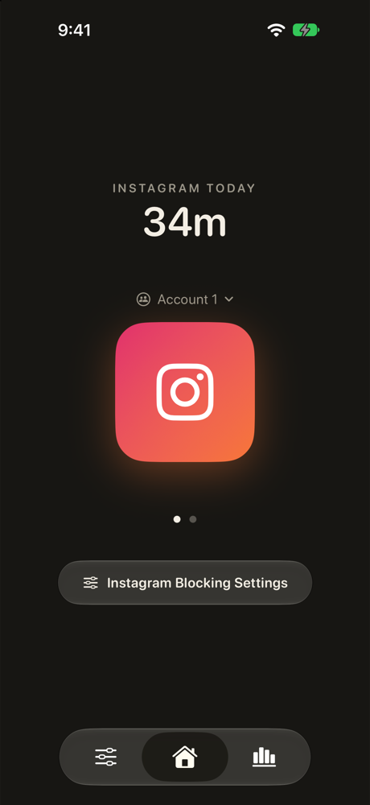
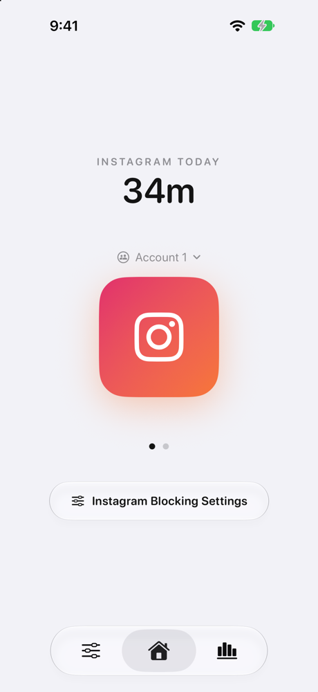
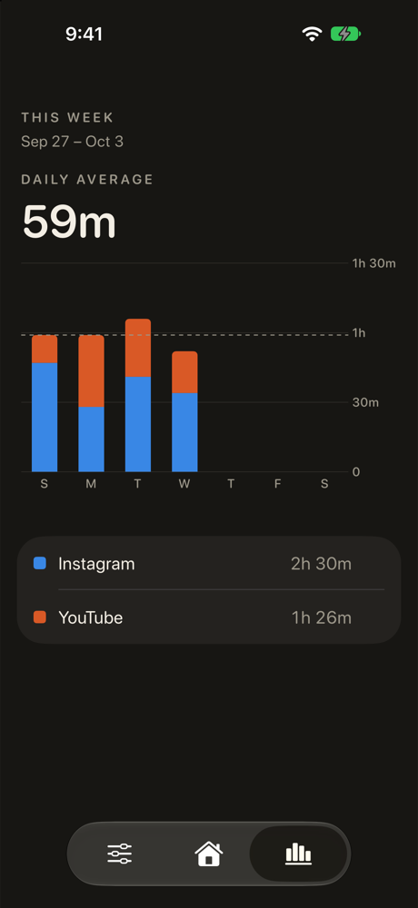
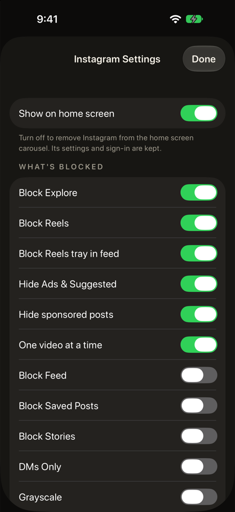
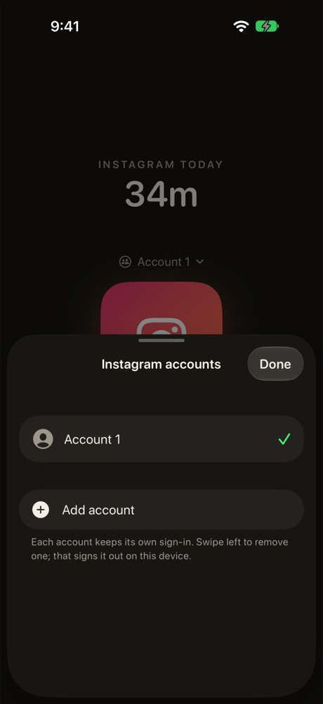

# Simpli

Instagram and YouTube without short-form video, on iPhone. A modified version
of [NoScroll](https://github.com/Blueturboguy07/noscroll) (AGPL-3.0), changed
from it in 2026 (see [Changes from NoScroll](#changes-from-noscroll)).

The app loads each service's mobile website in a `WKWebView` and injects a
small engine that hides or redirects the endless surfaces: Reels, Shorts,
Explore, suggested posts and ads. It keeps messages, the people you follow,
and posting. A reel sent in a DM plays on its own; you can't scroll to the next.

<p align="center">
  
  
  
  
  
</p>

## Changes from NoScroll

### Native Liquid Glass interface
Built in SwiftUI with iOS 26's Liquid Glass: the system tab bar, glass buttons,
and a floating glass menu that stretches and splits into Home, Refresh and
Picture in Picture. Sites run up under the status bar behind a soft scroll edge.
Earlier iOS versions get a material fallback.

### Visual improvements
One rounded type family and a quiet neutral palette throughout, a home screen
built around a carousel of app icons, and a System / Light / Dark setting that
applies to Instagram and YouTube too.

### Screen Time analytics
Time spent in each app, counted while it's open and kept only on the device.
A stacked weekly chart covers this week and last, with a daily average that
skips days you didn't open the app. Tap an app to see only its time; days roll
over at 4 AM, so late nights count toward the day before.

### Multiple account support
Several accounts per service, each with its own sign-in kept in a separate
website data store. Switch from above the app icon; swipe one away to sign it
out on the device.

### Picture in Picture
YouTube keeps playing in Picture in Picture when you leave the app from
fullscreen, and the floating menu starts or ends it from the normal player.

### Ad blocking
Instagram ads and sponsored posts are hidden in the feed again: NoScroll's ad
selectors no longer matched anything. Ads are now recognised by the link to
Meta's ad-click tracker that every ad carries and no normal post does. YouTube
ads are not blocked.

### Updated blocking logic
- **Instagram:** the home feed ends at "You're all caught up" instead of running
  on into suggested posts. Explore is no longer blocked outright, so its search
  box works, while its recommendation grid stays hidden. The "Use the app"
  banner is hidden, and the Reels tab's slot is removed rather than left empty.
  A reel or post opened from a DM is locked to that one item by stopping
  vertical scrolling only, so taps and carousel swipes still work.
- **YouTube:** the "Open App" button is removed.

### Improved blocking engine
The injected engine is cut down to what the app uses: no telemetry, rule-health
probes, gesture isolation or test hooks, down from 8.0 KB to 4.8 KB. Rules
remain signed data that the app verifies before anything is injected, and the
engine never touches sign-in pages.

### Decluttering
The Android app, Screen Time shielding, sleep mode, onboarding and CI tooling
are gone. Settings fold away for apps you hide from the home screen, and each
screen shows only what it needs.

### Bug fixes
- Instagram's feed no longer jumps back to the top while blocking runs.
- Tapping or swiping a carousel in a reel opened from a DM no longer throws you
  back to the chat.
- Instagram search works, and Explore no longer flashes before it's hidden.
- Every service opens its own site: NoScroll sent the six besides Instagram and
  YouTube to Instagram. A service's window also can't be left on another
  service's site, and Instagram and YouTube reopen on their home page.
- The Instagram message bar stays above the keyboard.

## Layout

```
docs/screenshots/        the images in this README
ios/NoScroll/            the app (SwiftUI shell + WKWebView wrapper)
  App/                   state, services, web screen, floating menu
  Home/                  home screen, settings, account switcher
  Web/                   WrappedWebViewController and the site scripts
  Core/                  rule bundle model and signature check, accounts
  Design/                colours, fonts, brand marks
  Resources/noscroll.js  the engine, built from engine/
  Resources/Rules/       signed rule bundles, copied from rules/
ios/NoScrollWidget/      home-screen widget (noscroll://open/<service>)
engine/                  TypeScript source of noscroll.js
rules/                   rule bundles (source of truth): selectors, routes
tools/sign-bundle.swift  signs rule bundles and copies them into the app
keys/                    private signing key (gitignored; back it up)
```

## Build

Open `ios/NoScroll.xcodeproj`. For both targets, pick your team under Signing &
Capabilities and change the bundle identifier (`com.ericli.Simpli` and
`com.ericli.Simpli.widget`) to your own. Choose a device and Run. iOS 17+; the
status-bar and scroll-edge treatment needs iOS 26.

## Changing blocking rules

Rules are data. Edit `rules/<service>.json`, then sign it; the app refuses a
bundle whose signature doesn't match its public key:

```bash
swift tools/sign-bundle.swift sign rules/instagram.json    # from the repo root
swift tools/sign-bundle.swift verify rules/*.json
```

The private key isn't in this repository. To change rules in your own build,
run `swift tools/sign-bundle.swift keygen` first: it creates your own key pair
and makes the app trust your public key instead, then sign every bundle.

Some behaviour that CSS selectors can't express lives in scripts in
`ios/NoScroll/Web/WrappedWebViewController.swift`: ending the Instagram feed at
"You're all caught up", locking DM reels and single posts, hiding the Explore
grid under the search box, hiding the "Use the app" banner, and reporting the
signed-in username for the account switcher.

## Engine

`Resources/noscroll.js` is the minified build of `engine/`
(`cd engine && pnpm install && pnpm build`, then copy `engine/dist/noscroll.js`
into `ios/NoScroll/Resources/`). Its source is kept here because the AGPL
requires shipping it with the app.

## Licence

AGPL-3.0-or-later. See [LICENSE](LICENSE). Not affiliated with Meta, Instagram,
Google or YouTube.
